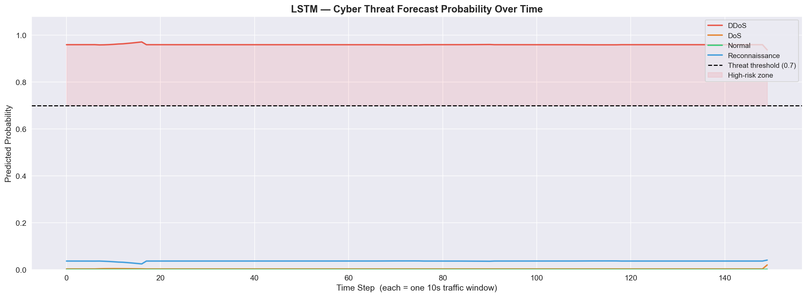
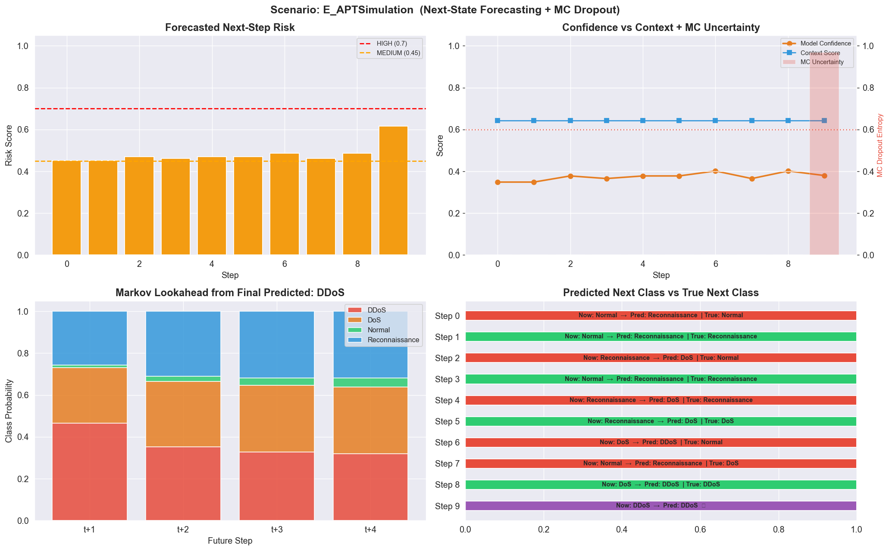

# 🛡️ Context-Aware Cyber Threat Forecasting

> **Predict the next attack before it happens** — a production-ready ML pipeline that classifies live network traffic *and* forecasts future threat states using a hybrid XGBoost → LSTM → Adaptive Markov architecture.

---

## 🔍 What This Project Does

Most intrusion detection systems react. This one **anticipates**.

Given a window of network traffic, the system:
1. **Classifies** each flow in real-time (Normal / DoS / DDoS / Reconnaissance)
2. **Forecasts** what threat class is likely to appear *next*
3. **Quantifies uncertainty** using Monte Carlo Dropout
4. **Weighs contextual signals** (time-of-day, device type, geolocation, threat history)
5. **Triggers tiered alerts** (🔴 HIGH / 🟠 MEDIUM / 🟢 LOW) with risk scores

---

## 🏗️ Architecture

The system is a **6-layer stacked pipeline** that moves from raw traffic ingestion all the way to proactive defense actions.

```
┌─────────────────────────────────────────────────────────────────┐
│  LAYER 1 — Data Ingestion                                       │
│  Bot-IoT CSV files · merge · deduplicate · EDA                  │
└───────────────────────────┬─────────────────────────────────────┘
                            │
┌───────────────────────────▼─────────────────────────────────────┐
│  LAYER 2 — Preprocessing                                        │
│  Train/test split · StandardScaler (train only) · SMOTE        │
└───────────────────────────┬─────────────────────────────────────┘
                            │
┌───────────────────────────▼─────────────────────────────────────┐
│  LAYER 3 — XGBoost Classification                               │
│  32 traffic features · regularised · isotonic calibration       │
│  Per-class adaptive thresholds                                  │
│  Output: class label + probability vector P(k|x)               │
└───────────────────────────┬─────────────────────────────────────┘
                            │
┌───────────────────────────▼─────────────────────────────────────┐
│  LAYER 4 — LSTM Temporal Forecasting                            │
│  Window W=10 · input: XGBoost proba sequences                   │
│  Predicts next state ŷ_next                                     │
│  2×LSTM(96→48) · BatchNorm · Dropout(0.3) · L2 regularisation  │
└──────────────┬──────────────────────────┬───────────────────────┘
               │                          │
┌──────────────▼──────────┐  ┌────────────▼──────────────────────┐
│  LAYER 5a — Markov      │  │  LAYER 5b — MC Dropout            │
│  Empirical P(next=j |   │  │  30 stochastic forward passes     │
│  current=i)             │  │  Epistemic uncertainty U ∈ [0,1]  │
│  Multi-step lookahead:  │  │                                   │
│  t+1, t+2, t+3         │  │                                   │
└──────────────┬──────────┘  └────────────┬──────────────────────┘
               │                          │
┌──────────────▼──────────┐  ┌────────────▼──────────────────────┐
│  Context Engine         │  │  LAYER 6 — Decision Engine v3     │
│  · Time of day          ├──►  XGB(5%) + LSTM(10%) +            │
│  · Device type          │  │  Markov(35%) + Context(50%)       │
│  · Network behaviour    │  │  Transition-weighted fusion        │
│  · Threat history       │  │  → R_final → Alert level          │
│  · Geolocation          │  │                                   │
└─────────────────────────┘  └────────────┬──────────────────────┘
                                          │
               ┌──────────────────────────┼──────────────────────┐
               │                          │                      │
    ┌──────────▼──────┐       ┌───────────▼───────┐  ┌──────────▼──────┐
    │  🔴 HIGH Alert  │       │  🟠 MEDIUM Alert  │  │  🟢 LOW Alert   │
    │  BLOCK · RATE   │       │  INCREASE         │  │  CONTINUE       │
    │  LIMIT          │       │  MONITORING       │  │  MONITORING     │
    └─────────────────┘       └───────────────────┘  └─────────────────┘
                                          │
┌─────────────────────────────────────────▼───────────────────────┐
│  Proactive Defense Actions                                      │
│  DDoS: BLOCK IP · RATE LIMIT · ACTIVATE MITIGATION             │
│  Recon: LOG SCAN · UPDATE FIREWALL  │  Normal: MONITOR          │
└─────────────────────────────────────────────────────────────────┘
```

**Decision Engine fusion weights:**

| Component | Weight | Role |
|---|---|---|
| XGBoost | 5% | Current-step classification signal |
| LSTM | 10% | Temporal sequence forecast |
| Adaptive Markov v3 | 35% | State transition probability |
| Context Engine | 50% | Time, device, network, history, geolocation |

---

## 📊 Model Performance

### Individual Model Metrics

| Model | Metric | Score |
|---|---|---|
| XGBoost (calibrated) | Test Accuracy | **99.89%** |
| XGBoost | Macro F1 (5-fold CV) | **0.9993 ± 0.0002** |
| XGBoost | Per-class F1 (DDoS / DoS / Normal / Recon) | **1.00 / 1.00 / 1.00 / 1.00** |
| LSTM | Validation Accuracy | **94.8%** |
| LSTM | Architecture | 2×LSTM(96→48) + BatchNorm + Dropout(0.3) |

**Dataset:** Bot-IoT — 3,668,522 flows × 46 features · **Class imbalance handled with SMOTE**

### Full Pipeline — Forecast Accuracy by Scenario

| Scenario | Steps | Forecast Acc | Avg Risk | HIGH Alerts | MED Alerts | Avg Uncertainty |
|---|---|---|---|---|---|---|
| 🟢 A — All Normal | 10 | **100%** | 0.519 | 0 | 10 | 0.097 |
| 🟠 B — Slow Escalation | 10 | **56%** | 0.491 | 0 | 10 | 0.097 |
| 🔴 C — Sudden DDoS | 10 | **67%** | 0.483 | 0 | 10 | 0.097 |
| 🔵 D — Stealth Recon | 10 | **22%** | 0.391 | 0 | 1 | 0.097 |
| 🟣 E — Recon Only | 10 | **56%** | 0.399 | 0 | 1 | 0.097 |

> **Note:** Stealth Recon (D) scores lower by design — the system is deliberately conservative on low-and-slow attacks to minimise false positives. The low alert count (1 vs 10) reflects correct restraint rather than model failure.

---

## 🚀 Demo Scenarios

The live demo (`demo1.py`) ships with 5 pre-built scenarios:

| Scenario | Description |
|---|---|
| 🟢 A — All Normal | Baseline healthy traffic |
| 🟠 B — Slow Escalation | Recon gradually escalates to DoS |
| 🔴 C — Sudden DDoS | Abrupt volumetric attack |
| 🔵 D — Stealth Recon | Low-and-slow reconnaissance sweep |
| 🟣 E — APT Simulation | Multi-stage advanced persistent threat |

---

## 🗂️ Repo Structure

```
├── demo1.py                        # Interactive demo (4 modes)
├── CyberThreat_FYP_Final_Clean.ipynb  # Full training notebook
├── fyp_saved_models/
│   ├── xgb_calibrated.pkl          # Trained XGBoost + isotonic calibration
│   ├── lstm_model.keras            # Trained LSTM forecaster
│   ├── scaler.pkl                  # Feature scaler
│   ├── label_encoder.pkl           # Class label encoder
│   ├── class_names.json            # [DDoS, DoS, Normal, Reconnaissance]
│   └── feature_cols.json           # 32 selected flow features
├── viz_01_raw_distribution.png     # Class distribution (raw)
├── viz_05_correlation_heatmap.png  # Feature correlation heatmap
├── viz_09_xgb_confusion.png        # XGBoost confusion matrix
├── viz_12_lstm_training.png        # LSTM training curves
├── viz_14_threat_forecast.png      # Markov forecast output
├── dashboard_*.png                 # Live dashboard screenshots
└── classification_basis.svg        # Architecture diagrams
```

---

## ⚡ Quick Start

```bash
# Clone the repository
git clone https://github.com/YOUR_USERNAME/cyber-threat-forecasting.git
cd cyber-threat-forecasting

# Install dependencies
pip install -r requirements.txt

# Run the interactive demo
python demo1.py
```

**Demo Modes:**
```
1 → Scenario Sweep     (all 5 pre-built scenarios)
2 → Real Samples       (draws from actual Bot-IoT data)
3 → Interactive        (enter your own feature values)
4 → Stress Test        (edge cases & uncertainty analysis)
```

---

## 🧰 Tech Stack

| Category | Libraries |
|---|---|
| ML / Classification | `XGBoost`, `scikit-learn` (isotonic calibration, SMOTE) |
| Deep Learning | `TensorFlow / Keras` (LSTM, MC Dropout) |
| Data Processing | `NumPy`, `Pandas` |
| Visualisation | `Matplotlib`, `Seaborn` |
| Serialisation | `joblib` |

---

## 🧠 Key Design Decisions

**Why XGBoost → LSTM (not end-to-end)?**  
XGBoost gives calibrated *probability vectors* per flow. The LSTM learns patterns over sequences of these probability vectors — a richer temporal signal than raw features.

**Why Adaptive Markov v3?**  
Pure neural forecasting ignores domain knowledge. The Markov layer blends three signals: empirical state transitions, cyber kill-chain escalation priors (Normal → Recon → DoS → DDoS), and real-time contextual signals.

**Why MC Dropout?**  
Uncertainty quantification matters in security. A high-confidence wrong prediction is more dangerous than an uncertain correct one. 30 stochastic forward passes give a calibrated uncertainty estimate alongside every forecast.

---

## 📸 Visualisations

<table>
  <tr>
    <td><br/><sub>XGBoost Confusion Matrix</sub></td>
    <td><br/><sub>LSTM Training Curves</sub></td>
    <td><br/><sub>Threat Forecast Output</sub></td>
  </tr>
  <tr>
    <td><br/><sub>Dashboard — Normal Traffic</sub></td>
    <td><br/><sub>Dashboard — DDoS Attack</sub></td>
    <td><br/><sub>Dashboard — APT Simulation</sub></td>
  </tr>
</table>

---

## 📄 Requirements

```
tensorflow>=2.12
xgboost>=1.7
scikit-learn>=1.2
imbalanced-learn>=0.10
numpy>=1.23
pandas>=1.5
matplotlib>=3.6
seaborn>=0.12
joblib>=1.2
```

---

## 👤 Author

SRIRAM S
BCA Spealization in AI & ML

[](https://linkedin.com/in/YOUR_PROFILE)
[](https://github.com/YOUR_USERNAME)

---

## ⭐ If this helped you

Give it a star — it helps others in cybersecurity & ML find this work!
