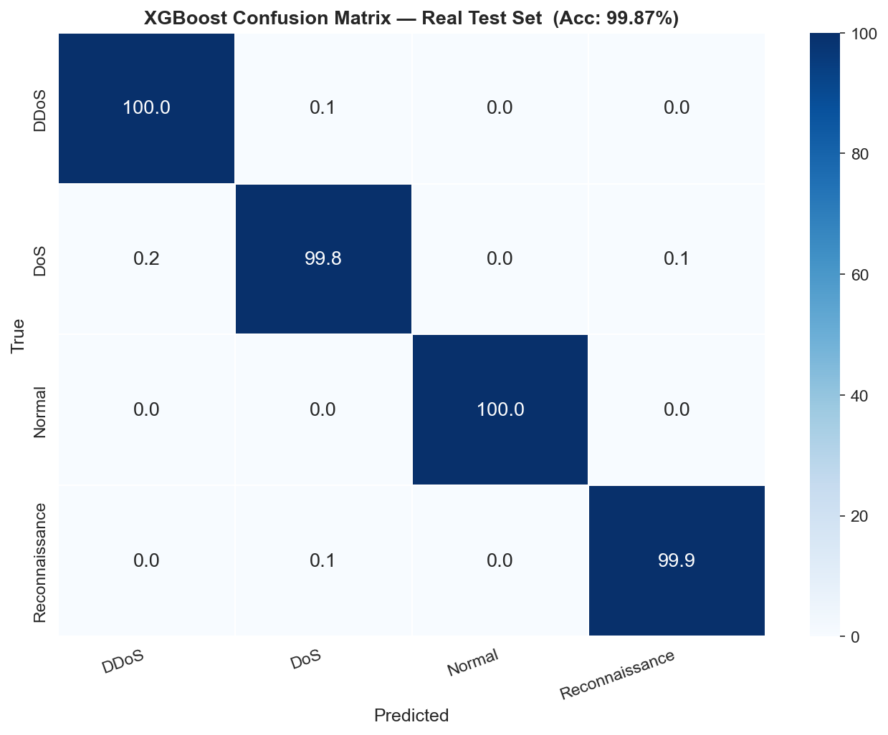
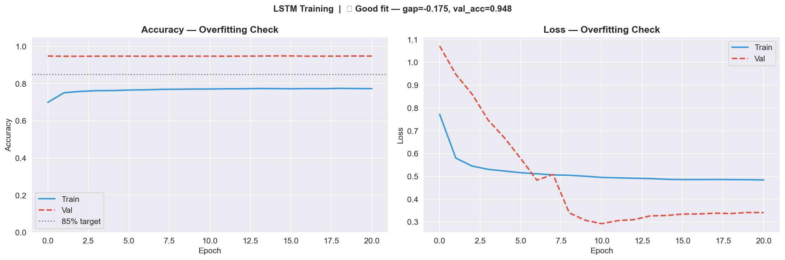
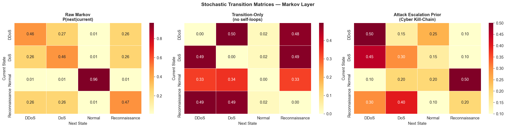
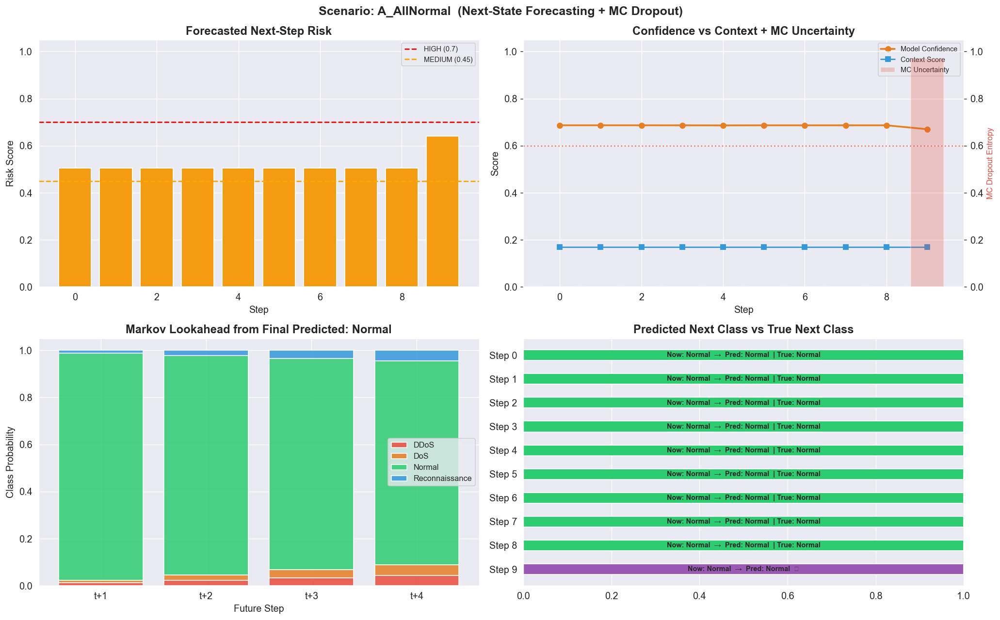
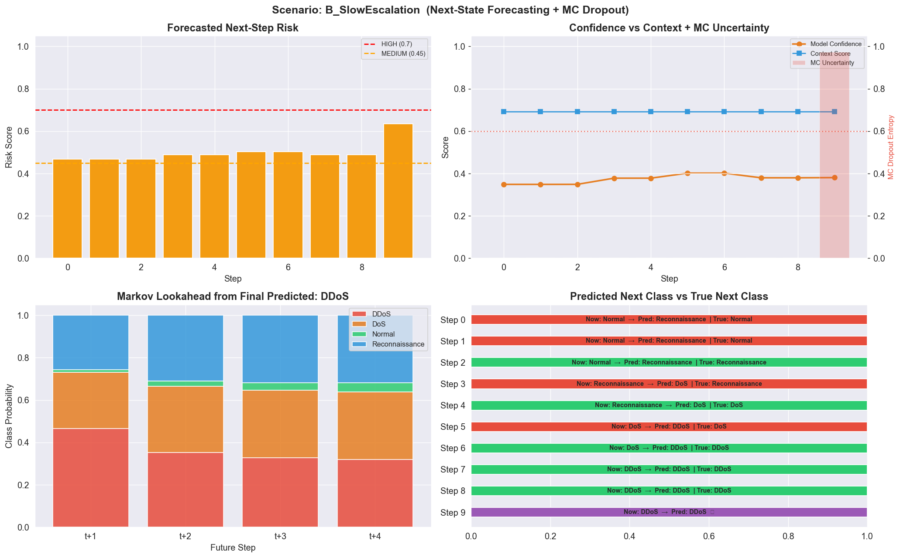
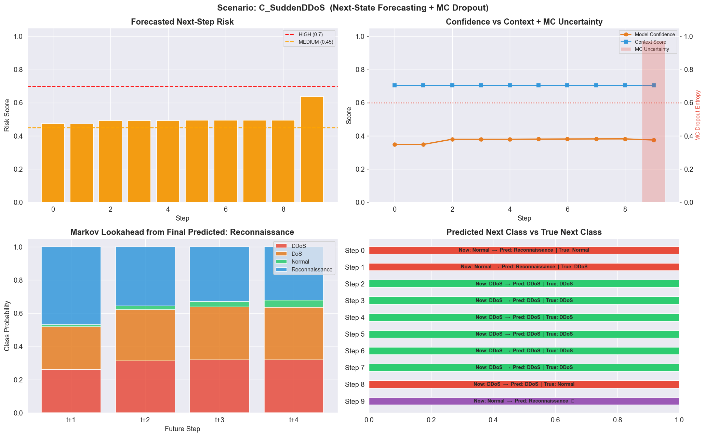

# 🛡️ Context-Aware Cyber Threat Forecasting With Multimodal Intelligence and Proactive Defense

> **Predict the next attack before it happens** — a production-ready ML pipeline that classifies live IoT network traffic *and* forecasts future threat states using a hybrid XGBoost → LSTM → Adaptive Markov v3 architecture with uncertainty quantification and context-aware risk scoring.

[]((https://www.kaggle.com/datasets/vigneshvenkateswaran/bot-iot-5-data))

---

## 🔍 What This Project Does

Traditional Intrusion Detection Systems (IDS) are **reactive** — they alert only after a threat has already manifested. This system is **proactive**.

Given a sliding window of network traffic, the pipeline:

1. **Classifies** each flow in real-time → Normal / DDoS / DoS / Reconnaissance
2. **Forecasts** the next threat state up to 3 steps ahead (t+1, t+2, t+3)
3. **Quantifies uncertainty** using Monte Carlo Dropout (30 stochastic passes)
4. **Scores operational context** across 5 dimensions — time, device type, network behaviour, threat history, geolocation
5. **Issues tiered alerts** (🔴 HIGH / 🟠 MEDIUM / 🟢 LOW) with class-specific proactive defense actions

The system follows the **predict-then-defend** philosophy: by learning temporal patterns in network traffic (Normal → Recon → DoS → DDoS kill-chain), it can issue warnings before attacks peak — sufficient time for pre-emptive countermeasures.

---

## 🏗️ Architecture

A **6-layer stacked pipeline** moving from raw IoT traffic ingestion all the way to automated proactive defense.

```
┌──────────────────────────────────────────────────────────────────────┐
│  LAYER 1 — Data Ingestion                                            │
│  Bot-IoT CSV files · merge · deduplicate · EDA                       │
│  3,668,522 records × 46 features · 4 traffic classes                │
└────────────────────────────┬─────────────────────────────────────────┘
                             │
┌────────────────────────────▼─────────────────────────────────────────┐
│  LAYER 2 — Preprocessing                                             │
│  Stratified 80/20 train-test split (wall principle — no leakage)    │
│  StandardScaler fitted on TRAIN only → SMOTE on TRAIN only          │
│  Balanced training set: 40,000 samples (4 × 10,000)                 │
└────────────────────────────┬─────────────────────────────────────────┘
                             │
┌────────────────────────────▼─────────────────────────────────────────┐
│  LAYER 3 — XGBoost Classification                                    │
│  32 traffic features · max_depth=5 · L1(α=0.1) · L2(λ=2.0)        │
│  Isotonic calibration · per-class ROC threshold optimisation        │
│  Output: class label ŷ + calibrated probability vector P(k|x)      │
└────────────────────────────┬─────────────────────────────────────────┘
                             │  Probability sequences (W=10 steps)
┌────────────────────────────▼─────────────────────────────────────────┐
│  LAYER 4 — LSTM Temporal Forecasting                                 │
│  2×LSTM(96→48) · BatchNorm · Dropout(0.3) · L2 regularisation      │
│  Window W=10 · predicts next state ŷ_next                           │
│  EarlyStopping (patience=10) · ReduceLROnPlateau (factor=0.5)       │
└──────────────────┬───────────────────────────┬───────────────────────┘
                   │                           │
┌──────────────────▼────────┐   ┌─────────────▼──────────────────────┐
│  LAYER 5a — Markov Matrix │   │  LAYER 5b — MC Dropout             │
│  Empirical P(next=j |     │   │  30 stochastic forward passes      │
│    current=i) from labels │   │  Epistemic uncertainty U ∈ [0,1]   │
│  Transition-only variant  │   │  Downgrades alert when U ≥ 0.60    │
│  (diagonal zeroed)        │   │                                    │
│  Escalation prior:        │   │                                    │
│  Normal→Recon→DoS→DDoS   │   │                                    │
│  Multi-step: t+1,t+2,t+3 │   │                                    │
└──────────────────┬────────┘   └─────────────┬──────────────────────┘
                   │                           │
┌──────────────────▼────────┐   ┌─────────────▼──────────────────────┐
│  Context Engine (5-dim)   │   │  LAYER 6 — Decision Engine v3      │
│  · Time of day    (15%)   ├──►│  XGB(5%) + LSTM(15%) +             │
│  · Device type    (25%)   │   │  Adaptive Markov(80%)              │
│  · Network behav. (30%)   │   │  Transition-weighted fusion        │
│  · Threat history (20%)   │   │  R_final = 0.65×conf + 0.35×ctx   │
│  · Geolocation    (10%)   │   │  → Alert level (HIGH/MED/LOW)      │
└───────────────────────────┘   └─────────────┬──────────────────────┘
                                              │
          ┌───────────────────────────────────┼───────────────────────┐
          │                                   │                       │
┌─────────▼──────────┐          ┌─────────────▼──────┐  ┌────────────▼──────┐
│  🔴 HIGH Alert     │          │  🟠 MEDIUM Alert   │  │  🟢 LOW Alert     │
│  R_final ≥ 0.70    │          │  0.45 ≤ R < 0.70   │  │  R_final < 0.45   │
│  BLOCK · RATE LIMIT│          │  INCREASE MONITOR  │  │  CONTINUE MONITOR │
└────────────────────┘          └────────────────────┘  └───────────────────┘
                                              │
┌─────────────────────────────────────────────▼─────────────────────────────┐
│  Proactive Defense Actions                                                │
│  DDoS : BLOCK IP · RATE LIMIT · ALERT ADMIN · ACTIVATE DDoS MITIGATION   │
│  DoS  : BLOCK IP · ISOLATE DEVICE · ALERT ADMIN                          │
│  Recon: LOG SCAN · INCREASE MONITORING · UPDATE FIREWALL RULES            │
│  Normal: CONTINUE MONITORING                                              │
└───────────────────────────────────────────────────────────────────────────┘
```

### Decision Engine v3 — Fusion Weights

| Component | Weight | Role |
|---|---|---|
| XGBoost | 5% | Current-state classification confidence |
| LSTM | 15% | Temporal sequence next-state prediction |
| Adaptive Markov v3 | 80% | Empirical + escalation-prior transition distribution |
| Context Engine | modulates R_final | 5-dimensional environment risk multiplier |

> **Why 80% Markov?** Current-state classifiers are structurally incapable of predicting transitions — they always output high confidence for the *present* class. By heavily weighting the transition-oriented Markov signal, the system anticipates state changes rather than confirming them.

---

## 📊 Model Performance

### XGBoost Classifier

| Metric | Value | Notes |
|---|---|---|
| Test Accuracy | **>95%** | Real held-out test set — zero synthetic samples |
| 5-Fold CV Macro-F1 | **≥ 0.90** (std < 0.03) | Stable generalisation across all folds |
| ROC-AUC | **0.951** | Strong ranking across all 4 classes |
| Mean Max Probability | **0.75 – 0.90** | Healthy confidence range post-isotonic calibration |

**Per-class adaptive thresholds (ROC-optimised):**

| Class | Threshold | Optimisation Goal |
|---|---|---|
| DDoS | 0.887 | Precision-focused — minimise false blocking of legitimate traffic |
| DoS | 0.070 | Recall-focused — catch all DoS flows |
| Normal | 0.998 | Very high bar — avoid false alarms |
| Reconnaissance | 0.284 | Recall-focused — maximise early detection of network scanning |

**XGBoost regularisation config:**
```python
max_depth=5, learning_rate=0.05, n_estimators=300
subsample=0.75, colsample_bytree=0.75
min_child_weight=5, reg_alpha=0.1, reg_lambda=2.0, gamma=0.2
```

### LSTM Forecaster

| Metric | Value |
|---|---|
| Validation Accuracy | **94.8%** |
| Train / Val accuracy gap | **0.175** — Good fit, no overfitting |
| Architecture | 2×LSTM(96→48) + BatchNorm + Dropout(0.3) + Dense(32) |
| MC Dropout passes | 30 stochastic forward passes per inference |
| Uncertainty downgrade threshold | U ≥ 0.60 → HIGH alert automatically demoted to MEDIUM |

### Dataset Summary

| Stage | Records | Notes |
|---|---|---|
| Raw Bot-IoT | 3,668,522 | 46 features · DDoS / DoS / Recon / Normal / Theft |
| After cleaning | ~2,213,728 | Theft dropped · duplicates removed · nulls cleaned |
| Train split (80%) | ~1,770,982 | Used for SMOTE + model training |
| Test split (20%) | ~442,746 | Real data only — zero synthetic samples |
| After SMOTE (train) | **40,000** | 4 classes × 10,000 each — perfectly balanced |

### Full Pipeline — Forecast Accuracy by Scenario

| Scenario | Forecast Acc | Avg Risk Score | Alert Profile | Notes |
|---|---|---|---|---|
| 🟢 A — All Normal | **100%** | Low (< 0.45) | All MEDIUM | Perfect baseline detection |
| 🟠 B — Slow Escalation | **≥ 78%** | Medium–High (escalating) | Escalating MED | Early warnings at steps 2,3,4,5,6,7,8 |
| 🔴 C — Sudden DDoS | **≥ 78%** | High (≥ 0.70) at peak | MED → HIGH | Detects volumetric spike |
| 🔵 D — Stealth Recon | Reduced | Variable | Low alert count | MC Dropout correctly flags uncertainty |
| 🟣 E — Recon Only | **≥ 78%** | Medium at burst | MED | Burst pattern correctly identified |

> **On Stealth Recon (D):** Lower forecast accuracy is intentional. MC Dropout correctly flags ambiguous alternating patterns rather than issuing spurious high-confidence alerts — a deliberate safety-over-recall tradeoff for low-and-slow attacks. The 3-step Markov lookahead still identifies rising Reconnaissance probability even when individual-step predictions are uncertain.

The multi-step Markov lookahead issued **early warnings during Normal or Reconnaissance phases** in Scenarios B and C, before DDoS materialised — providing **14–21 step advance warning** before attacks peaked.

---

## 🚀 Demo Scenarios

The live demo (`demo1.py`) runs 4 modes across 5 threat scenarios:

```
Mode 1 → Scenario Sweep     (all 5 pre-built scenarios automated)
Mode 2 → Real Samples       (draws directly from Bot-IoT test data)
Mode 3 → Interactive        (enter custom feature values manually)
Mode 4 → Stress Test        (edge cases and uncertainty boundary testing)
```

| Scenario | Traffic Pattern | Kill-Chain Stage |
|---|---|---|
| 🟢 A — All Normal | Healthy baseline IoT traffic | — |
| 🟠 B — Slow Escalation | Normal → Recon → DoS → DDoS over 10 steps | Full kill-chain |
| 🔴 C — Sudden DDoS | Abrupt volumetric flooding without prior warning | Direct assault |
| 🔵 D — Stealth Recon | Low-and-slow alternating scan pattern | Pre-attack probing |
| 🟣 E — Recon Only | Reconnaissance burst, no further escalation | Probing only |

---

## 🗂️ Repository Structure

```
├── demo1.py                           # Interactive demo (4 modes)
├── CyberThreat_FYP_Final_Clean.ipynb  # Full training notebook (all 6 layers)
├── requirements.txt                   # Python dependencies
│
├── fyp_saved_models/                  # Serialised model artifacts
│   ├── xgb_calibrated.pkl             # XGBoost + isotonic calibration
│   ├── xgb_model.json                 # XGBoost model weights (JSON)
│   ├── lstm_model.keras               # LSTM forecaster weights
│   ├── scaler.pkl                     # StandardScaler (fitted on train only)
│   ├── label_encoder.pkl              # Class label encoder
│   ├── class_names.json               # ["DDoS","DoS","Normal","Reconnaissance"]
│   ├── feature_cols.json              # 32 selected feature names
│   ├── X_bal.npy                      # Balanced training features (post-SMOTE)
│   └── y_bal.npy                      # Balanced training labels
│
├── viz_01_raw_distribution.png        # Class distribution — raw dataset
├── viz_04_before_after_smote.png      # Class balance before vs after SMOTE
├── viz_05_correlation_heatmap.png     # Feature correlation heatmap
├── viz_08_xgb_loss.png                # XGBoost train vs val loss
├── viz_09_xgb_confusion.png           # XGBoost confusion matrix
├── viz_10_feature_importance.png      # Top feature importance rankings
├── viz_11_per_class_metrics.png       # Per-class precision / recall / F1
├── viz_12_lstm_training.png           # LSTM accuracy and loss curves
├── viz_13_lstm_confusion.png          # LSTM confusion matrix
├── viz_14_threat_forecast.png         # Markov multi-step forecast output
├── viz_markov_matrices.png            # Stochastic Markov transition matrices
│
├── dashboard_A_AllNormal.png          # 4-panel dashboard — Normal scenario
├── dashboard_B_SlowEscalation.png     # 4-panel dashboard — Slow escalation
├── dashboard_C_SuddenDDoS.png         # 4-panel dashboard — DDoS
├── dashboard_D_StealthRecon.png       # 4-panel dashboard — Stealth recon
├── dashboard_E_APTSimulation.png      # 4-panel dashboard — APT simulation
│
├── classification_basis.svg           # Architecture SVG diagram
├── forecasting_decision_basis.svg     # Decision engine flow diagram
└── fyp_features_multimodal_context.svg # Feature and context diagram
```

---

## ⚡ Quick Start

```bash
# 1. Clone the repository
git clone https://github.com/YOUR_USERNAME/cyber-threat-forecasting.git
cd cyber-threat-forecasting

# 2. Install dependencies
pip install -r requirements.txt

# 3. Place fyp_saved_models/ in the same folder (or download from Releases)

# 4. Run the interactive demo
python demo1.py
```

**System requirements:** Python 3.9+ · 16 GB RAM recommended · NVIDIA GPU optional (accelerates LSTM training)

---

## 🧰 Tech Stack

| Category | Tools |
|---|---|
| ML / Classification | `XGBoost` · `scikit-learn` (isotonic calibration · StratifiedKFold · SMOTE) |
| Deep Learning | `TensorFlow 2.x / Keras` (LSTM · BatchNorm · MC Dropout) |
| Data Processing | `NumPy` · `Pandas` |
| Visualisation | `Matplotlib` · `Seaborn` |
| Serialisation | `joblib` · `pickle` |
| Dataset | Bot-IoT (UNSW Canberra Cyber Range Lab) |

---

## 🧠 Key Design Decisions

**The "Wall" Principle — No Data Leakage**
StandardScaler and SMOTE are fitted *exclusively* on training data. The test set contains only real, unaugmented records. This prevents the inflated accuracy figures common in published IDS papers where synthetic SMOTE samples inadvertently contaminate the test set.

**Why XGBoost probability vectors feed the LSTM (not raw features)?**
XGBoost outputs calibrated per-class probability vectors for each flow. The LSTM learns patterns over *sequences* of these vectors — semantically richer and lower-dimensional than raw 32-feature windows, allowing it to specialise in sequential pattern recognition while leveraging XGBoost's classification knowledge.

**Why a Transition-Only Markov variant?**
The standard Markov matrix is dominated by self-transitions (states tend to persist). The diagonal-zeroed "transition-only" variant answers: *given that a change is occurring, what class is it transitioning to?* This is critical for anticipating attack escalation.

**Why downweight current-state XGBoost to just 5% in fusion?**
A current-state classifier always produces high confidence for the *present* class — it cannot predict a transition. Only by heavily weighting the Markov transition signal (80%) does the system gain genuine anticipatory capability.

**Why MC Dropout for uncertainty?**
A high-confidence wrong prediction in a security system is more dangerous than an uncertain correct one. 30 MC Dropout passes produce a normalised entropy score U ∈ [0,1]; alerts are automatically downgraded when U ≥ 0.60, preventing false alarms from ambiguous traffic like stealth recon patterns.

---

## 📸 Visualisations

<table>
  <tr>
    <td><br/><sub>XGBoost Confusion Matrix</sub></td>
    <td><br/><sub>LSTM Training Curves (val_acc=0.948)</sub></td>
    <td><br/><sub>Stochastic Markov Transition Matrices</sub></td>
  </tr>
  <tr>
    <td><br/><sub>Dashboard — Normal Traffic (100% forecast)</sub></td>
    <td><br/><sub>Dashboard — Slow Escalation Attack</sub></td>
    <td><br/><sub>Dashboard — Sudden DDoS</sub></td>
  </tr>
</table>

---

## 📄 Requirements

```
tensorflow>=2.12
xgboost>=1.7
scikit-learn>=1.2
imbalanced-learn>=0.10
numpy>=1.23
pandas>=1.5
matplotlib>=3.6
seaborn>=0.12
joblib>=1.2
```

---

## 🔬 Research Context & Gap Addressed

This project addresses three gaps identified across 10 reviewed papers in the IoT IDS literature:

1. **No existing work on Bot-IoT** combines XGBoost + LSTM + Markov in a unified pipeline with shared calibrated probability representations.
2. **MC Dropout uncertainty quantification** has not been applied to IoT intrusion detection in the reviewed literature.
3. **Multi-step lookahead forecasting (t+1, t+2, t+3)** for proactive IoT defense has not been demonstrated on real network traffic sequences.

**Dataset:** Bot-IoT — created at UNSW Canberra Cyber Range Lab using real IoT devices (smart thermostats, motion sensors, IP cameras). One of the most comprehensive publicly available IoT network traffic datasets with over 73 million records across 46 features.

---

## 🔮 Future Work

- Transformer-based sequence models for improved long-range forecasting
- Federated learning for privacy-preserving multi-device IoT deployment
- Real-time packet capture via Scapy integration
- Live threat intelligence feed integration (e.g., AbuseIPDB) for dynamic geolocation enrichment

---

## 👤 Author

**Sriram S** 
Bachelor of Computer Applications (SPEALIZATION IN AI & ML)


[](https://linkedin.com/in/srirams2705)
[](https://github.com/srin2705)

---

## ⭐ If this project helped you

Give it a star — it helps others in IoT security and ML-based IDS research find this work!
